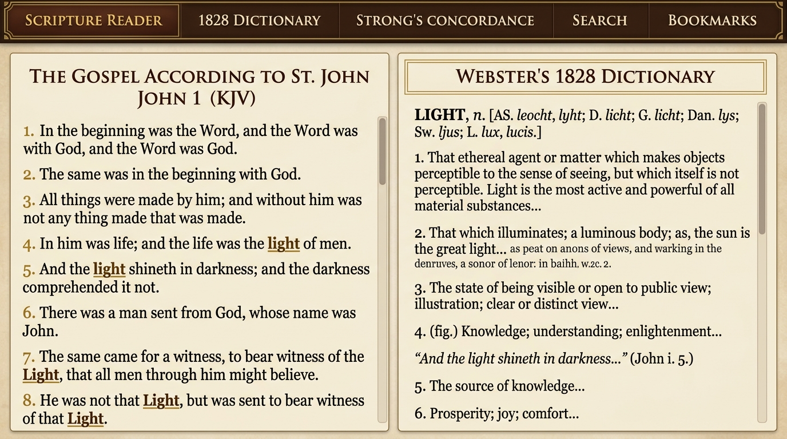
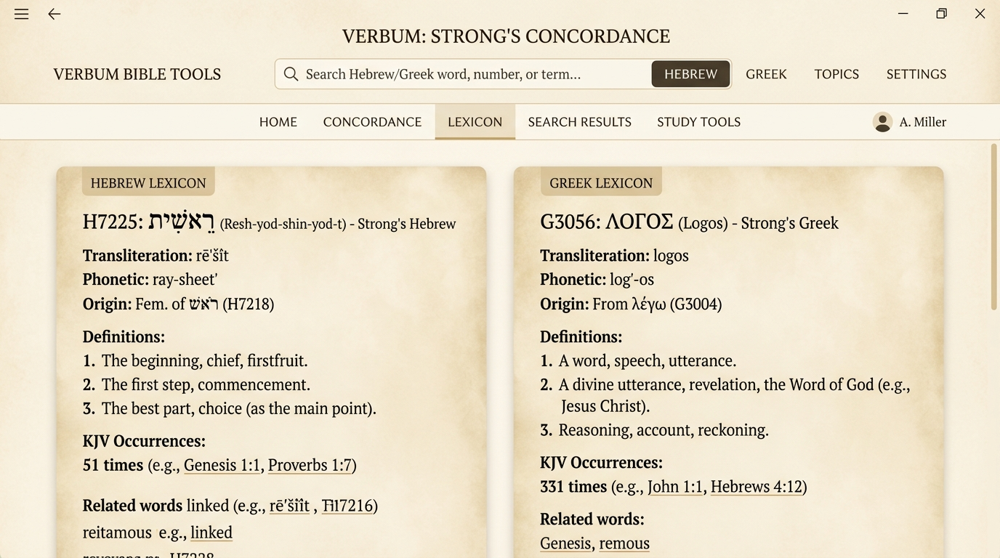

# Classical Bible Study Suite

A beautiful, completely self-contained Scripture study application combining the **Authorized 1611 King James Bible**, **Noah Webster's 1828 American Dictionary**, and **James Strong's Exhaustive Hebrew & Greek Concordance**.

100% Free • 100% Offline • No Sign-ups • No Ads • No Paid API Subscriptions

**Created Date**: September 11, 2026 • **Last Modified Date**: September 11, 2026

---

## Screenshots

### 📖 Scripture Reader with Webster's 1828 Split View
Read King James Scripture alongside Noah Webster's original 1828 biblical dictionary definitions. Clicking any word automatically looks up its historical meaning and checks for original Hebrew and Greek roots.



### 📜 Strong's Hebrew & Greek Concordance
Explore original Old Testament Hebrew and New Testament Greek root words with authentic scripts, phonetic pronunciations, transliterations, and exact verse count occurrences.



---

## What is This App?

> **Project Scope**: This project is specifically focused on the historic 1611 King James Version, Noah Webster's 1828 Dictionary, and Strong's Concordance. It is provided as-is for personal Bible study.

This app is a personal Bible study workstation designed to run on your own computer (Windows, Mac, or Linux). 

Unlike modern websites that track your activity or charge monthly subscriptions:
- **Everything is stored on your computer**: All 31,102 verses, the entire Webster 1828 dictionary, and all 14,000+ Strong's Hebrew and Greek definitions are saved locally in the folder.
- **Works without an internet connection**: Once installed, you can take your laptop anywhere—even offline or in airplane mode—and study freely.
- **Zero data collection**: Your bookmarks, notes, reading history, and settings never leave your computer.

---

## 🌟 Beginner's Guide: How to Run This (In 5 Minutes)

You do **not** need to be a programmer or software engineer to run this! Just follow these simple steps:

### Step 1: Install Node.js (It's Free and Safe)
Node.js is a free, widely used program that lets your computer run modern web applications locally.
1. Go to the official website: **[https://nodejs.org/](https://nodejs.org/)**
2. Click the big green button that says **LTS (Recommended for Most Users)**.
3. Open the downloaded file and click **Next / Install** until it finishes. (Default options are fine).

### Step 2: Download This Project
1. Scroll to the top of this GitHub page.
2. Click the green **Code** button, then click **Download ZIP**.
3. Once downloaded, **Extract (Unzip)** the folder to a place you can easily find, such as your `Desktop` or `Documents` folder.

### Step 3: Open the Terminal / Command Prompt in That Folder

- **On Windows**:
  1. Open the extracted folder so you see files like `package.json` and `README.md`.
  2. Click in the folder's address bar at the top, type `cmd`, and press **Enter**.
  *(A black Command Prompt window will open directly in that folder).*

- **On Mac**:
  1. Open the **Terminal** app (press `Command + Space`, type `Terminal`, and press Enter).
  2. Type `cd ` (with a space after it).
  3. Drag and drop the extracted folder from Finder right into the Terminal window, then press **Enter**.

### Step 4: Install and Start the App
In that black window, copy and paste the following line, then press **Enter**:

```bash
npm install
```
*(Wait 1 to 2 minutes while it prepares the application).*

Once that finishes, copy and paste this command and press **Enter**:

```bash
npm run build && npm start
```
You will see a message saying: `Server running on http://localhost:3000`.

### Step 5: Open the App in Your Browser!
Open Google Chrome, Safari, Microsoft Edge, or Firefox, and go to:
👉 **[http://localhost:3000](http://localhost:3000)**

**That's it! You are now using the Classical Bible Study Suite!**

> **How to close the app when you are done**: Return to the black Terminal window and press `Ctrl + C` on your keyboard.  
> **How to start it again tomorrow**: Open the folder in Terminal/CMD again and just type `npm start`.

---

## ⚡ Quick Start for Developers & Tech Users

For developers familiar with git and the terminal:

```bash
# 1. Clone repository
git clone https://github.com/your-username/bible-study-suite.git
cd bible-study-suite

# 2. Install dependencies
npm install

# 3. Development mode (with live frontend reload)
npm run dev

# 4. Production build & start
npm run build
npm start
```

### Docker One-Liner
```bash
docker build -t bible-study-suite .
docker run -d -p 3000:3000 --name bible-suite bible-study-suite
```

---

## Key Features

- 📖 **Authorized 1611 King James Bible**: All 66 books, preserving original translator italics, chapter summaries, and verse navigation.
- 📚 **Noah Webster's 1828 Dictionary**: The complete historic 1828 dictionary with authentic Christian definitions and Scripture cross-references.
- 📜 **Strong's Exhaustive Concordance**: Complete Old Testament Hebrew (H1–H8674) and New Testament Greek (G1–G5624) lexicons with original scripts, pronunciation guides, and translation breakdowns.
- 🔗 **Interactive One-Click Word Study**: Click any English word in Scripture to immediately view its 1828 definition and original Hebrew/Greek root words.
- 🪟 **Side-by-Side Dual Pane**: Read Scripture on the left while searching definitions or root lemmas on the right.
- 🔊 **Built-in Narration**: Listen to chapter verses read aloud using your browser's native speech engine (no third-party cloud speech subscriptions required).
- 🔍 **Fast Concordance Search**: Search all 31,102 verses in under 10 milliseconds with Old Testament / New Testament filters.
- 🔖 **Local Study Notebook**: Bookmark verses, save word studies, and track reading history with instant local persistence.

---

## Additional Documentation

For more detailed guides, check out the specialized guides in this repository:

- 📋 **[INSTALL.md](./INSTALL.md)**: In-depth installation instructions for Windows, macOS, Linux, Raspberry Pi, Docker, and Bun, plus tips on making a one-click desktop shortcut.
- 🛠️ **[HELP.md](./HELP.md)**: Full technical documentation covering server architecture, memory management, and REST API endpoint specifications.

---

## License & Public Domain Notice

- **Software Code**: Licensed under the open-source **[MIT License](./LICENSE)**. You are free to use, modify, host, and distribute it.
- **Underlying Texts**: The 1611 Authorized King James Version, Noah Webster's 1828 Dictionary, and James Strong's 1890 Concordance are historical works in the **public domain worldwide**.
- **Scope & Disclaimer**: This project is specifically focused on the historic 1611 King James Version, Noah Webster's 1828 Dictionary, and Strong's Concordance. It is provided as-is for personal Bible study.
